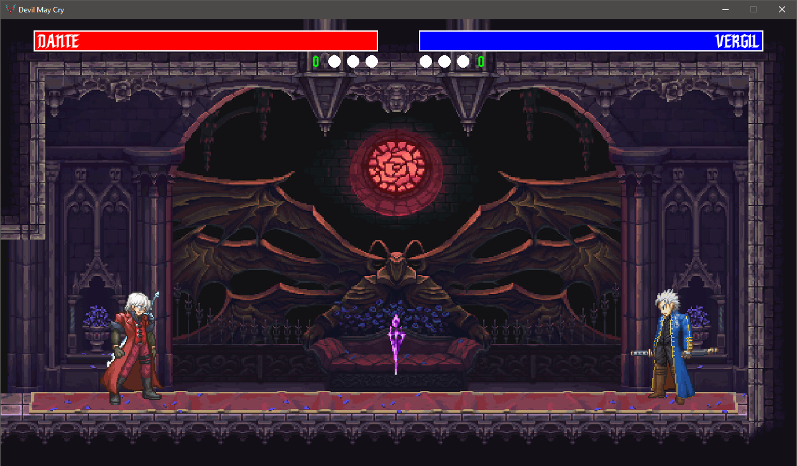

# Devil May Cry Brawler

## Sobre

Este projeto foi desenvolvido como atividade prática da disciplina de **Tópicos Especiais**, parte do curso de **Ciência da Computação**. O jogo é um **brawler 2D** com temática inspirada na franquia **Devil May Cry**, em que dois jogadores podem controlar os personagens **Dante** e **Vergil** em combates corpo a corpo. O foco do projeto foi aplicar os conceitos aprendidos ao longo da disciplina, utilizando a biblioteca **PyGame** para o desenvolvimento do jogo.

**Preview:**



## Ferramentas utilizadas

Para a criação e edição dos recursos visuais utilizados no jogo, foram utilizadas as seguintes ferramentas:

* [**Aseprite**](https://www.aseprite.org/) — edição e animação de sprites.
* [**Piskel**](https://www.piskelapp.com/) — ferramenta online para criação e edição de pixel art.
* [**JPEXS Free Flash Decompiler**](https://github.com/jindrapetrik/jpexs-decompiler) — utilizado para extrair sprites de um mod do jogo **Super Smash Flash 2**.
* [**Input-Button-Sprite-Generator**](https://github.com/NetroScript/Input-Button-Sprite-Generator/tree/master) — ferramenta para gerar imagens representando os botões do teclado utilizados no jogo.
* [**Canva**](https://www.canva.com/) — utilizado para edição das imagens de fundo com instruções de controle.

## Inspiração

O desenvolvimento deste projeto foi inspirado no repositório [**Street Fighter Clone Made in Python**](https://github.com/russs123/brawler_tut), criado por russ123. A base estrutural do jogo, incluindo o gerenciamento de estados e movimentação dos personagens, foi adaptada a partir deste projeto.

## Como jogar

Siga os passos abaixo para jogar o **Devil May Cry Brawler** no seu computador:

### 1. Clone o repositório ou baixe como .zip

* **Clonando com Git:**

  ```bash
  git clone https://github.com/seu-usuario/devil-may-cry-brawler.git
  ```

  ```bash
  cd devil-may-cry-brawler
  ```

* **Ou baixe o projeto como ZIP:**

  * Clique em **Code** > **Download ZIP** no topo da página do repositório.
  * Extraia o conteúdo em uma pasta local.
  * Acesse a pasta extraída via terminal ou prompt de comando.

### 2. Tenha o Python 3.11 ou superior instalado

Você pode baixar a versão mais recente do Python em: [https://www.python.org/downloads/](https://www.python.org/downloads/)

Verifique se está instalado corretamente com:

```bash
python --version
```

ou

```bash
python3 --version
```

Certifique-se de que a versão exibida seja **3.11** ou superior.

### 3. Crie e ative um ambiente virtual (opcional, mas recomendado)

Criar um ambiente virtual ajuda a manter as dependências do projeto isoladas do restante do sistema.

**No Windows (CMD):**

```bash
python -m venv venv
```

```bash
cd venv\Scripts
```

```bash
activate
```

```bash
cd ../..
```

**No macOS/Linux:**

```bash
python3 -m venv venv
source venv/bin/activate
```

Você saberá que o ambiente virtual está ativado quando o nome dele aparecer entre parênteses no terminal.

### 4. Instale as dependências

Com o ambiente virtual ativado, execute:

```bash
pip install -r requirements.txt
```

### 5. Execute o jogo

Para iniciar o jogo, execute:

```bash
python main.py
```

O jogo será aberto em uma nova janela. Siga as instruções de controle exibidas na tela para jogar no modo local com dois jogadores.

---

**IFSULDEMINAS - Câmpus Muzambinho**  
**Curso:** Ciência da Computação  
**Disciplina:** Tópicos Especiais I  
**Docente:** Ricardo José Martins